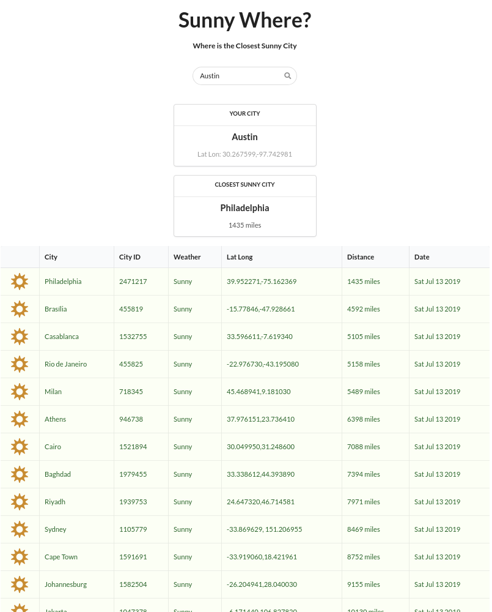

# Sunny Where?

A simple single page app that shows the closest sunny city, based on results from the MetaWeather API <https://www.metaweather.com/api/>

## Overview

- Once a day uses the Heroku Scheduler to trigger a staggered axios query to MetaWeather for the status of 88 of the most populated cities in the world
- Search uses MetaWeather location finder to enable autocomplete
- Results are grouped by weather type and sorted by distance to your city

## 5 min Video Walk-through

Click image to start walk-through

## Stack

- Node
- SemanticUI
- MetaWeather API
- Axios
- EJS
- jQuery

## Screenshot

